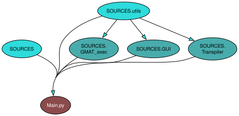

# AM1_MILESTONE_7
ASIGNATURA: 
         
         Ampliación de Matemáticas 1

AUTORES: 

         Pablo Castillo Jiménez
         Ana Jorba Vera 
         Belén Álvarez Capitán 
         Marcos Salcedo López

DIAGRAMA:

INSTRUCCIONES DE USO:

         El programa se puede ejecutar por consola desde Main.py, o utilizando el ejecutable SimuladorOrbital.exe

         

